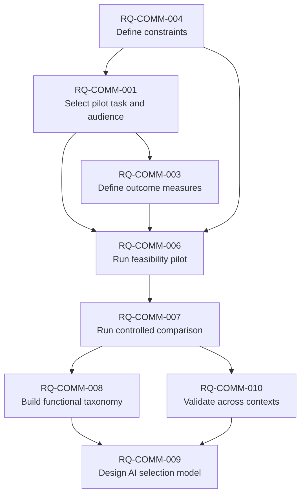

# Communication Engineering portfolio roadmap

**Portfolio version:** 0.2.0
**Updated:** 2026-07-30  
**Authority:** mutable frontier view governed by DF-COMM-2026-0001  
**Program objective:** develop and validate a context-sensitive framework that
helps humans and AI choose communication strategies for specified audiences,
objectives, and constraints.

## Portfolio thesis

The program should advance from measurable, low-risk communication tasks toward
broader explanatory and selection models. It must not begin with an exhaustive
style catalog or AI optimizer: both depend on validated constructs, outcomes,
and boundary conditions.

## Prioritization method

Priority is a judgment based on five 0–3 factors:

- decision leverage;
- uncertainty reduction;
- dependency unlock;
- feasibility;
- risk reduction.

Scores support review but do not replace reasoning. Safety, ethics, missing
authority, or decisive evidence can override a total. Ties favor work that
creates discriminating evidence and reusable measurement infrastructure.

## Current portfolio graph

## Portfolio items

### RQ-COMM-001 — Select a concrete pilot task and audience

- **Parent:** program objective
- **Children:** RQ-COMM-006
- **Maturity:** Scoping
- **Priority:** P0; score 13/15 (leverage 3, uncertainty 3, unlock 3,
  feasibility 2, risk reduction 2)
- **Supporting evidence:** EV-COMM-2026-0001 through 0003;
  HY-COMM-2026-0001
- **Contradicting evidence:** none direct
- **Dependencies:** RQ-COMM-003, RQ-COMM-004
- **Related research:** RQ-COMM-005, RQ-COMM-011
- **Produced artifacts:** RP-COMM-2026-0001; MS-COMM-2026-0001
- **Engineering enabled:** experimental harness and reusable task fixtures
- **Confidence:** Medium that procedural documentation is the right class; Low
  for any specific task
- **Largest uncertainty:** stakeholder value and representative recruitment
- **Next action:** interview or otherwise obtain evidence from at least one
  intended user group; compare three task candidates against a frozen rubric
- **Exit evidence:** named audience, observed need, safe synthetic task,
  measurable success/failure, feasible recruitment, and no floor/ceiling result
- **Review trigger:** task candidate requires sensitive data or specialist harm
  review

### RQ-COMM-002 — Test the disciplinary boundary

- **Parent:** program objective
- **Children:** RQ-COMM-008
- **Maturity:** Idea
- **Priority:** P2; score 8/15
- **Supporting evidence:** none
- **Contradicting evidence:** repository charter warns against assuming a new
  discipline
- **Dependencies:** two completed empirical cycles
- **Related research:** communication theory, HCI, rhetoric, information
  architecture, technical communication, systems engineering
- **Produced artifacts:** none
- **Engineering enabled:** vocabulary and repository/product boundary decisions
- **Confidence:** Low
- **Largest uncertainty:** whether the proposed field adds predictive or
  operational value beyond integration of existing fields
- **Next action:** defer comparative review until the program has concrete
  constructs and outcomes
- **Exit evidence:** explicit comparison of scope, mechanisms, methods,
  predictions, and incremental utility
- **Review trigger:** any external-facing discipline claim

### RQ-COMM-003 — Define a purpose-to-outcome measurement model

- **Parent:** program objective
- **Children:** RQ-COMM-001, RQ-COMM-006, RQ-COMM-007
- **Maturity:** Deep Investigation
- **Priority:** P0; score 14/15
- **Supporting evidence:** EV-COMM-2026-0001 through 0005 and 0007 through
  0010; HY-COMM-2026-0003
- **Contradicting evidence:** EV-COMM-2026-0004 and 0009 show metric divergence;
  EV-COMM-2026-0007 contradicts universal use of time
- **Dependencies:** none for scoping; task selection for validation
- **Related research:** psychometrics, usability, learning science, decision
  science
- **Produced artifacts:** preliminary matrix below; RP-COMM-2026-0001 and
  0002; active mission MS-COMM-2026-0002
- **Engineering enabled:** scoring rubric, instrumentation, acceptance tests
- **Confidence:** Medium
- **Largest uncertainty:** task-specific reliability, sensitivity, burden, and
  accessibility feasibility
- **Next action:** apply the RP-COMM-2026-0002 scoring specification to three
  RQ-COMM-001 candidate tasks, then run an independent-rater and floor/ceiling
  feasibility check
- **Exit evidence:** reliability, validity, sensitivity, burden, and failure-mode
  assessment for each selected measure
- **Review trigger:** primary outcome chosen or pilot produces metric conflict

Preliminary outcome architecture:

| Communication purpose | Primary candidate outcome | Guardrails | Common invalid proxy |
|---|---|---|---|
| Inform | accurate comprehension | calibration, accessibility | reading level |
| Instruct | unassisted correct task completion | critical errors, assistance, accessibility | preference or speed alone |
| Teach | delayed transfer to a new problem | misconceptions, effort | immediate recall |
| Support a decision | decision quality relative to stated values/evidence | uncertainty understanding, harm | conversion |
| Persuade ethically | informed, autonomous attitude/action change | truth, coercion, subgroup harm | engagement |
| Coordinate | shared state and correct next actions | latency, repair cost | message count |
| Build warranted trust | trust calibration to actual reliability | skepticism, correction response | trust score alone |

### RQ-COMM-004 — Establish ethical, privacy, safety, and accessibility constraints

- **Parent:** program objective
- **Children:** RQ-COMM-001, RQ-COMM-006, RQ-COMM-009
- **Maturity:** Scoping
- **Priority:** P0; score 13/15
- **Supporting evidence:** EV-COMM-2026-0006; GV-ENG-001
- **Contradicting evidence:** none
- **Dependencies:** task/data-flow detail for validation
- **Related research:** RQ-COMM-012
- **Produced artifacts:** synthetic-data constraint in MS-COMM-2026-0001
- **Engineering enabled:** recruitment/data plan, accessibility acceptance
  criteria, safe optimization boundaries
- **Confidence:** Medium
- **Largest uncertainty:** participant-data classification and applicable review
- **Next action:** write a task-specific data flow and harm analysis after
  RQ-COMM-001 selects candidates
- **Exit evidence:** data inventory, retention, consent/review determination,
  accessibility scope, abuse cases, and stop conditions
- **Review trigger:** real user data, vulnerable groups, or high-stakes content

### RQ-COMM-005 — Pre-register the ROS comparison baseline

- **Parent:** repository pilot
- **Children:** none
- **Maturity:** Scoping
- **Priority:** P1; score 11/15
- **Supporting evidence:** PILOT-MEASUREMENT-communication-engineering
- **Contradicting evidence:** no comparable prior-project data
- **Dependencies:** RQ-COMM-001 scope freeze
- **Related research:** all first-slice work
- **Produced artifacts:** draft pilot measurement plan
- **Engineering enabled:** ROS continue/simplify/reject decision
- **Confidence:** Medium
- **Largest uncertainty:** credible counterfactual baseline
- **Next action:** freeze a lightweight non-ROS workflow before implementation
- **Exit evidence:** comparable inputs/outcomes, time accounting, and known
  confounders
- **Review trigger:** scope freeze

### RQ-COMM-006 — Feasibility-test the procedural experiment

- **Parent:** RQ-COMM-001
- **Children:** RQ-COMM-007
- **Maturity:** Idea
- **Priority:** P1; score 10/15
- **Supporting evidence:** HY-COMM-2026-0001 and 0003
- **Contradicting evidence:** none
- **Dependencies:** RQ-COMM-001, 003, 004
- **Related research:** MS-COMM-2026-0001
- **Produced artifacts:** planned EX-COMM-2026-0001
- **Engineering enabled:** frozen experimental harness
- **Confidence:** Low before task selection
- **Largest uncertainty:** scoring reliability, effect sensitivity, and
  participant burden
- **Next action:** remain blocked from activation until dependencies exit
- **Exit evidence:** executable protocol, usable scoring, acceptable burden, no
  floor/ceiling effect
- **Review trigger:** task selection

### RQ-COMM-007 — Estimate effects of controlled communication variants

- **Parent:** RQ-COMM-006
- **Children:** RQ-COMM-008, RQ-COMM-010
- **Maturity:** Idea
- **Priority:** P2; score 8/15
- **Supporting evidence:** none generated by this repository
- **Contradicting evidence:** none
- **Dependencies:** successful RQ-COMM-006 and analysis plan
- **Related research:** HY-COMM-2026-0002
- **Produced artifacts:** planned RP-COMM-2026-0003
- **Engineering enabled:** evidence-based document transformation
- **Confidence:** Low
- **Largest uncertainty:** causal separation of wording, structure, and visuals
- **Next action:** design only after feasibility
- **Exit evidence:** uncertainty intervals, failure analysis, subgroup limits,
  replication decision
- **Review trigger:** feasibility exit

### RQ-COMM-008 — Build a functional communication taxonomy

- **Parent:** RQ-COMM-002, RQ-COMM-007
- **Children:** RQ-COMM-009
- **Maturity:** Idea
- **Priority:** P2; score 7/15
- **Supporting evidence:** TH-COMM-2026-0001 predicts function/context matter
- **Contradicting evidence:** no exhaustiveness evidence
- **Dependencies:** stable constructs and at least one empirical cycle
- **Related research:** genres, rhetoric, discourse, information design
- **Produced artifacts:** none
- **Engineering enabled:** strategy retrieval and comparison
- **Confidence:** Low
- **Largest uncertainty:** classification dimensions and boundary criteria
- **Next action:** collect candidate dimensions without claiming completeness
- **Exit evidence:** explicit inclusion rules, multi-label structure,
  inter-rater test, counterexamples
- **Review trigger:** completion of RQ-COMM-007

### RQ-COMM-009 — Design an AI strategy-selection model

- **Parent:** RQ-COMM-008, RQ-COMM-010
- **Children:** none
- **Maturity:** Idea
- **Priority:** P3; score 5/15
- **Supporting evidence:** none
- **Contradicting evidence:** missing validated inputs/outcomes
- **Dependencies:** RQ-COMM-004, 008, 010
- **Related research:** AI instruction following, uncertainty calibration
- **Produced artifacts:** none
- **Engineering enabled:** adaptive communication system
- **Confidence:** Very Low
- **Largest uncertainty:** safe inference under missing audience/context data
- **Next action:** define misuse cases only; do not implement optimizer
- **Exit evidence:** validated input schema, abstention/fallback rules, offline
  evaluation, harm analysis
- **Review trigger:** supported taxonomy and cross-context findings

### RQ-COMM-010 — Test generalization across audiences and contexts

- **Parent:** RQ-COMM-007
- **Children:** RQ-COMM-009
- **Maturity:** Idea
- **Priority:** P2; score 8/15
- **Supporting evidence:** TH-COMM-2026-0001 predicts moderation
- **Contradicting evidence:** none
- **Dependencies:** replicated within-context effect
- **Related research:** cross-cultural pragmatics, expertise reversal,
  accessibility
- **Produced artifacts:** none
- **Engineering enabled:** applicability boundaries and adaptive rules
- **Confidence:** Low
- **Largest uncertainty:** which moderators are decision-relevant
- **Next action:** preregister replication contexts after first effect
- **Exit evidence:** heterogeneous-effects model and failed-generalization cases
- **Review trigger:** replicated RQ-COMM-007 effect

### RQ-COMM-011 — Explain documentation longevity and decay

- **Parent:** program objective
- **Children:** none
- **Maturity:** Idea
- **Priority:** P2; score 7/15
- **Supporting evidence:** none
- **Contradicting evidence:** none
- **Dependencies:** corpus access and longevity definition
- **Related research:** maintenance, information architecture, software evolution
- **Produced artifacts:** none
- **Engineering enabled:** durable documentation architecture and decay monitors
- **Confidence:** Very Low
- **Largest uncertainty:** survivorship bias and measurable usefulness over time
- **Next action:** scope longitudinal corpus and falsifiable longevity signals
- **Exit evidence:** sampling method, outcome definition, confounder model
- **Review trigger:** first pilot completes or a suitable corpus becomes available

### RQ-COMM-012 — Define anti-manipulation boundaries

- **Parent:** RQ-COMM-004
- **Children:** RQ-COMM-009
- **Maturity:** Idea
- **Priority:** P1; score 10/15
- **Supporting evidence:** constitutional safety and ethical constraints
- **Contradicting evidence:** none
- **Dependencies:** representative persuasion/decision use cases
- **Related research:** dark patterns, informed consent, autonomy, rhetoric
- **Produced artifacts:** none
- **Engineering enabled:** optimization constraints and refusal rules
- **Confidence:** Low
- **Largest uncertainty:** operational distinction between ethical persuasion and
  manipulation across power asymmetries
- **Next action:** comparative normative and empirical scoping before any
  persuasion engineering
- **Exit evidence:** abuse cases, red lines, review thresholds, contested cases
- **Review trigger:** any persuasion or behavior-change project

## Stage gates

| Transition | Minimum evidence |
|---|---|
| Idea → Scoping | decision relevance, owner candidate, explicit uncertainty |
| Scoping → Background Research | bounded question, inclusion criteria, evidence plan |
| Background Research → Deep Investigation | credible hypotheses and discriminating method |
| Deep Investigation → Validation | reusable result plus explicit falsification target |
| Validation → Synthesis | replication/triangulation and bounded applicability |
| Synthesis → Engineering Ready | accepted theory/decision, requirements, constraints, acceptance tests |
| Engineering Ready → Monitoring | implementation validated and telemetry/review triggers defined |

Items may move backward when assumptions fail, sources prove dependent, measures
are invalid, or boundary conditions narrow materially.

## Portfolio review cadence

- Review after every REP, failed experiment, material contradiction, or
  engineering decision.
- Review dormant P0/P1 items every 30 days while the portfolio is active.
- Review P2/P3 items quarterly or when dependencies change.
- Record deletions only as supersession or archival; never erase prior rationale.

## Current portfolio decision

Continue MS-COMM-2026-0002 at Deep Investigation. Its desk-research phase
selected an outcome vector, but task-specific validity remains blocked on
RQ-COMM-001 candidate tasks. The highest-value next input is evidence from a
named audience and comparison of three candidate tasks.
Do not activate the participant experiment until RQ-COMM-001, 003, and 004
meet their exit evidence.
